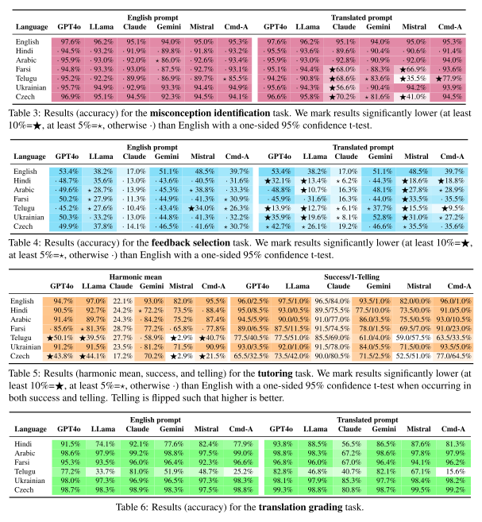

# Multilingual Educational LLM bias

This repository accompanies the paper [**Multilingual Performance Biases of Large Language Models in Education**](https://arxiv.org/abs/2504.17720).

> **Abstract:**
> Large language models (LLMs) are increasingly being adopted in educational settings.
These applications expand beyond English, though current LLMs remain primarily English-centric.
In this work, we ascertain if their use in education settings in non-English languages is warranted. We evaluated the performance of popular LLMs on four educational tasks: identifying student misconceptions, providing targeted feedback, interactive tutoring, and grading translations in six languages (**Hindi, Arabic, Farsi, Telugu, Ukrainian, Czech**) in addition to **English**.
We find that the performance on these tasks somewhat corresponds to the amount of language represented in training data, with lower-resource languages having poorer task performance.
Although the models perform reasonably well in most languages, the frequent performance drop from English is significant.
Thus, we recommend that practitioners first verify that the LLM works well in the target language for their educational task before deployment.



## Data structure

The dataset covers four tasks:
- Misconception identification
- Feedback selection
- Tutoring
- Translation grading

The dataset, split per language, is present in [`data/`](data/), together with the description of the data format.

> [!WARNING]  
> The public data contains only tutoring and translation grading, with misconception and feedback task data being gated.
> For inquiries, please send us a private message.

## Reproducing the dataset and analysis

See [`scripts/`](scripts/) and READMEs in respective directories.

## Misc.

If you use this work, please cite as:

```bibtex
@misc{gupta2025multilingualperformancebiaseslarge,
      title={Multilingual Performance Biases of Large Language Models in Education}, 
      author={Vansh Gupta and Sankalan Pal Chowdhury and Vilém Zouhar and Donya Rooein and Mrinmaya Sachan},
      year={2025},
      eprint={2504.17720},
      archivePrefix={arXiv},
      primaryClass={cs.CL},
      url={https://arxiv.org/abs/2504.17720}, 
}
```

For more information, contact [`spalchowd@ethz.ch`](mailto:spalchowd@ethz.ch).
